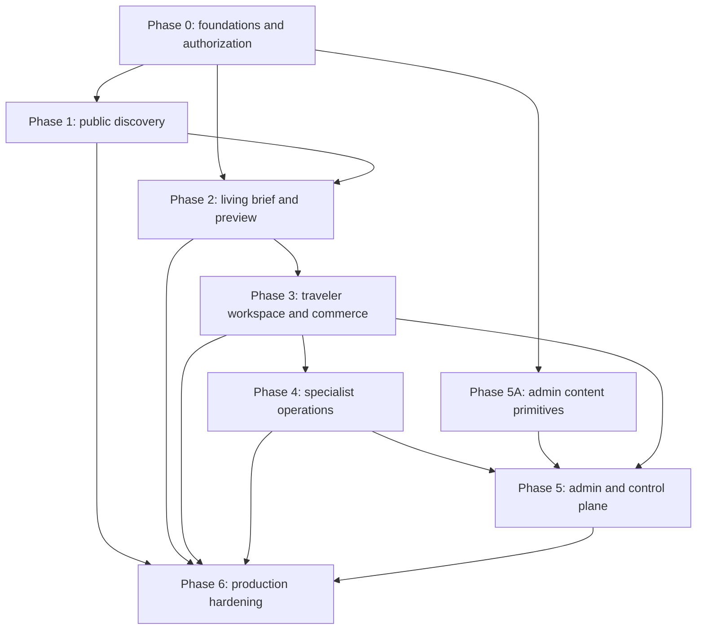

# Rumia Full Product Rework Master Implementation Plan

> **For agentic workers:** REQUIRED SUB-SKILL: Use superpowers:subagent-driven-development (recommended) or superpowers:executing-plans to implement this plan task-by-task. Steps use checkbox (`- [ ]`) syntax for tracking.

**Goal:** Rebuild every Rumia route into one Portugal-first, choice-led travel product with a secure traveler journey, persisted route versions, attributable local review, and role-scoped operator workspaces.

**Architecture:** The work is split into seven independently testable phase plans. Phase 0 establishes routes, shells, readiness, capabilities, data safety, and evidence contracts; Phases 1–5 deliver public, planner, traveler, specialist, and control-plane products in dependency order; Phase 6 verifies hosted state and activates providers one flag at a time. Server-produced projections and database authorization remain the security boundary throughout.

**Tech Stack:** Node 24, pnpm 10.34.5, Next.js 16 App Router and Proxy, React 19.2, TypeScript 5.9 strict mode, Tailwind CSS 4, Turborepo, Supabase Postgres 17/Auth/Storage/PostGIS/pgvector, MapLibre/CARTO, OpenAI structured outputs behind an adapter, Stripe Checkout, Resend, QStash, Sentry, Vitest, Testing Library, Playwright, and axe.

## Global Constraints

- Product and public content are Portugal-first and English-only for this release.
- The traveler planning path is choice-first prose: premade inline phrases can be replaced, typed over, or erased; no boxed form grid or dropdown is visible.
- No user-facing route uses a closed-choice dropdown or conventional stacked form as its primary interaction. Closed choices use inline phrase rails, segmented modes, chips, or direct cards; free-text/native file controls appear only where the value cannot truthfully be predefined.
- Native semantic controls remain underneath the prose interaction for accessibility, autofill, and validation.
- AI is infrastructure, never a chatbot persona; deterministic phrase choices work with live AI disabled.
- Free preview, €19 Full itinerary, and €49 Local expert polish use one server-owned catalogue.
- Human review is trip-scoped, proposal-led, assigned-reviewer-only, and never represented by fabricated identity or evidence.
- Raw route versions, payment records, reviewer notes, message bodies, and private Storage objects are never directly readable by an untrusted client.
- Every protected operation is checked at page/layout, handler/action, and database RLS/Storage boundaries.
- User-editable metadata is never an authorization source.
- Feature flags default off outside explicitly approved environments and never imply provider or migration readiness.
- pnpm is pinned to `10.34.5`; package-manager versions below `10.34.0` are rejected because CVE-2026-50017 can expose unscoped registry credentials to a repository-selected registry.
- Production refuses fixture adapters; explicit demo mode is labelled and has no live mutations.
- Exactly one `main`, one visible `h1`, one working skip target, and no document-level overflow at 390px are required on every route.
- Public/traveler p75 budgets are LCP ≤2.5s, INP ≤200ms, and CLS ≤0.10.
- Operator budgets are LCP ≤2.5s desktop and ≤3.5s mobile, INP ≤200ms, and CLS ≤0.10.
- Compressed initial JavaScript budgets are public ≤220KB, planner/trip ≤320KB, and operator ≤300KB, excluding a lazy map chunk.
- First-viewport images are ≤600KB at 390px and ≤1.2MB at 1440px; one mobile hero is ≤450KB.
- First usable map is ≤4.0s mobile and ≤2.5s desktop; measured interactions contain no blocking task over 50ms.
- No production flag is enabled until staging RLS, provider smoke, visual, accessibility, performance, and rollback gates pass.

---

## Approved source

- Product and interaction contract: `docs/superpowers/specs/2026-07-10-rumia-full-product-rework-design.md`
- This plan supersedes `docs/superpowers/plans/2026-07-09-choice-led-traveler-experience.md`; preserve its history but do not execute its remaining unchecked tasks.

## Plan set

| Order | Plan | Working release |
| --- | --- | --- |
| 0 | `docs/superpowers/plans/2026-07-10-rumia-phase-0-foundations.md` | Safe shells, exact routes, readiness, capabilities, phrase primitive, and executable evidence matrix |
| 1 | `docs/superpowers/plans/2026-07-10-rumia-phase-1-public-discovery.md` | Complete public proposition, Portugal atlas, trust, pricing, legal, offline, and sign-in surfaces |
| 2 | `docs/superpowers/plans/2026-07-10-rumia-phase-2-living-brief.md` | Living Brief Composer, deterministic choices, custom parsing, anonymous preview, claim, and route version 1 |
| 3 | `docs/superpowers/plans/2026-07-10-rumia-phase-3-traveler-commerce.md` | Trip workspace, route editing, independent entitlements, Stripe, export, library, Vault, review, and sharing |
| 4 | `docs/superpowers/plans/2026-07-10-rumia-phase-4-specialist-operations.md` | Specialist applications, assigned-reviewer queue, revision workspace, proposals, history, profile, and messaging |
| 5 | `docs/superpowers/plans/2026-07-10-rumia-phase-5-admin-control-plane.md` | Content, quality, operations cases, knowledge, metrics, configuration, and organization-isolated B2B |
| 6 | `docs/superpowers/plans/2026-07-10-rumia-phase-6-production-hardening.md` | Hosted reconciliation, durable workers, observability, analytics, complete matrix, canaries, and controlled rollout |

## Page-by-page visual and execution ownership

| Route | Final visual/interaction purpose | Owning task |
| --- | --- | --- |
| `/` | Cinematic linen/olive discovery gate, inline starter sentence, selective editorial imagery, and a clear Planner action | 1.2 |
| `/portugal` | Eight-region editorial atlas with synchronized map/list and route archetypes | 1.1, 1.3 |
| `/explore`, `/explore/workspace` | Permanent canonical redirects; no competing shell or product | 0.5, 1.8 |
| `/how-it-works` | Three-act product storyboard from intent to route to local judgment | 1.4 |
| `/local-expertise` | Evidence-led human-review explanation with named, real proof only | 1.4 |
| `/human-review` | Permanent redirect to Local expertise | 0.5, 1.8 |
| `/pricing` | One visual tier ledger driven by the server catalogue: Free, €19 Full, €49 Local Polish | 1.5 |
| `/support` | Tier-aware support paths, response expectations, and emergency limitation | 1.6 |
| `/privacy`, `/terms`, `/sustainability` | Calm versioned legal reading layout with approved, substantiated content | 1.6 |
| `/offline` | Connection state, cached-pack truth, last sync, retry, and safe recovery | 1.6, 3.7 |
| `/sign-in` | Sentence-style magic-link entry preserving a safe permitted return | 1.7 |
| `/planner` | Living Brief prose with editable/erasable phrases, in-flow choice rails, consequence line, and preview | 2.1–2.7 |
| `/plan` | Permanent redirect to Planner | 0.5 |
| `/trip/new` | One-phrase exception resolver only; never a second full form | 2.8 |
| `/trip/[tripId]` | Context capsule, one next action, route workspace, agenda, integrity ledger, and access/review status | 3.2–3.3 |
| `/trip/[tripId]/map` | Synchronized route editor with direct option rails, list equivalent, undo, and save/conflict status | 3.4 |
| `/trip/[tripId]/export` | Format/status ledger for version-bound PDF, calendar, print, retry, expiry, and download | 3.6 |
| `/checkout?trip=` | Tier ascension and persisted payment-return state; no query-param success theater | 3.5 |
| `/itineraries` | Single trip library with lifecycle filters, thumbnails, status, and next action | 3.7 |
| `/vault` | Offline packs, exports, and share-link assets only | 3.7, 3.9 |
| `/account` | Identity, preferences, privacy, receipts, support, and sign out; no duplicate trip grid | 3.7 |
| `/logistics` | Trip-scoped helper/redirect outcome; absent trip returns to Planner | 0.5, 3.3 |
| `/expert-chat` | Trip review conversation only when eligible/ready; otherwise truthful unavailable/redirect state | 3.8, 4.8 |
| `/share/trip/[token]` | Read-only noindex/no-referrer route projection with no editing or identity leakage | 3.9 |
| `/reviewer/queue` | Queue/Active views with SLA, blockers, stage, compact intent, and next action | 4.3–4.4 |
| `/reviewer/trips/[tripId]` | Persisted-route Brief/Route/Checks/Proposals workspace with audit and completion gate | 4.5–4.6 |
| `/reviewer/history` | Paginated completed evidence from real events, including truthful empty/error states | 4.7 |
| `/reviewer/profile` | Availability, coverage, specialties, languages, workload, notifications, and verification state | 4.7 |
| `/reviewer/operations` | Permanent redirect to reviewer Queue | 4.3 |
| `/admin/places` | Responsive List/Map/Edit evidence workspace with optimistic revision and audit | 5.1–5.2 |
| `/admin/regions` | Portugal rollout/content-readiness workspace | 5.3 |
| `/admin/partners` | Partner agreement, coverage, quality, evidence, revision, and audit workspace | 5.3 |
| `/admin/specialists` | Queue/Evidence/Decision verification surface using the atomic Phase 4 command | 5.4 |
| `/admin/quality` | Real integrity cases with evidence, owner, status, decision, and resolution audit | 5.4 |
| `/admin/countries`, `/admin/reviewers`, `/admin/analytics` | Exact permanent redirects to Regions, Specialists, and Console Metrics | 5.3 |
| `/console`, `/console/pipeline` | Console redirect plus responsive operations-case pipeline with lane tabs and accessible move controls | 5.5 |
| `/console/workspace` | Selected case in Case/Timeline/Actions modes; no case returns to Pipeline | 5.6 |
| `/console/messages` | Operations-only Conversations/Thread/Case Context messaging | 5.6 |
| `/console/graph` | Knowledge Tree/Node/Relationships with evidence and provider state, never raw vectors | 5.7 |
| `/console/metrics` | Summary/Funnel/Cohorts with distinct value/zero/untracked/unavailable states | 5.7 |
| `/console/config` | Versions/Diff/Deploy with validation, two-principal confirmation, rollback, and audit | 5.8 |
| `/guide`, `/guide/onboarding` | Gated status plus staged Regions→Languages→Specialties→Service→Evidence→Review flow | 4.2 |
| `/b2b`, `/b2b/[orgSlug]` | Beta interest or organization-scoped Overview/Templates/Requests/Members workspace | 5.9 |
| `/api/v1/docs` | Capability-gated sanitized current API reference; production default is 404 | 5.10 |

Every row is captured at 1440×900 and 390×844 for each applicable persona/state by Tasks 0.9 and 6.7. Redirect rows assert status and `Location` instead of taking decorative snapshots.

## Dependency graph



## Cross-plan interface ledger

The following names are authoritative. A later phase may extend a type with new fields but must not rename these contracts.

```ts
export type ApiErrorEnvelope = {
  code: string;
  message: string;
  fieldErrors?: Record<string, readonly string[]>;
};

export type Capability =
  | "access:manage"
  | "content:manage"
  | "operations:manage"
  | "analytics:read"
  | "configuration:deploy"
  | "developer_docs:read"
  | "specialists:verify";

export type AppRole = "traveler" | "reviewer" | "admin";

export type AuthorizedActor = {
  userId: string;
  roles: readonly AppRole[];
  capabilities: readonly Capability[];
  reviewerId: string | null;
  correlationId: string;
  client: RotaDataClient;
};

export type AccessRequirement = {
  anyRole?: readonly AppRole[];
  allCapabilities?: readonly Capability[];
  activeReviewerTripId?: string;
  organizationId?: string;
};

export type FeatureReadiness =
  | { status: "ready" }
  | { status: "disabled"; reason: "flag_off" }
  | {
      status: "unavailable";
      failed: readonly (
        | "credentials"
        | "migration"
        | "rls"
        | "provider"
        | "capability"
      )[];
    };

export type PhraseState =
  | "prompt"
  | "choosing"
  | "editing"
  | "parsing"
  | "accepted"
  | "needs_clarification"
  | "conflict"
  | "provider_unavailable";

export type TripLifecycle =
  | "draft"
  | "resolving"
  | "generating"
  | "generation_failed"
  | "preview_ready"
  | "active"
  | "completed"
  | "archived";

export type ProductSku = "full_itinerary_v1" | "local_polish_v1";
export type OrderState =
  | "eligible"
  | "session_creating"
  | "redirected"
  | "webhook_pending"
  | "confirmed"
  | "canceled"
  | "failed"
  | "refunded"
  | "disputed";
export type EntitlementState =
  | "none"
  | "pending"
  | "active"
  | "fulfilled"
  | "suspended"
  | "revoked";

export type RouteVersionRef = {
  tripId: string;
  version: number;
  checksum: string;
};

export type RotaDataClient = Pick<
  import("@supabase/supabase-js").SupabaseClient,
  "from" | "rpc"
>;

export type UserDataOptions = {
  client: RotaDataClient;
  actorUserId: string;
  correlationId: string;
};

export type SystemDataOptions = {
  client: RotaDataClient;
  actorKind: "system" | "worker" | "admin";
  actorUserId: string | null;
  correlationId: string;
};
```

## Migration policy

- Never edit a committed migration to change hosted behavior; add a forward migration.
- Start every migration task with the exact `pnpm exec supabase migration new name` command stated in that phase task after the Phase 0 CLI pin lands.
- The generated filename is then the only SQL file staged by that migration task.
- Every exposed-schema table enables RLS and receives explicit Data API grants only when the app needs direct access.
- Private helpers use the `private` schema, revoke `PUBLIC` execution, check `auth.uid()`, and grant only the required authenticated/service roles.
- Views use `security_invoker = true` or remain outside exposed schemas.
- Every migration task runs `pnpm check:migrations`, `pnpm exec supabase db reset`, SQL policy tests, and the Supabase lint/advisor command discovered through `--help`.

## Execution sequence

- [ ] Execute and pass every task in Phase 0.
- [ ] Enable no production feature; capture a Phase 0 staging baseline.
- [ ] Execute Phase 1 and release the public proposition after its route-family gate.
- [ ] Execute Phase 2 and release anonymous/signed-in preview only after claim and route-version RLS tests pass.
- [ ] Execute Phase 3; enable Stripe, exports, review purchase, and sharing independently after their gates.
- [ ] Execute Phase 4; enable reviewer and Guide surfaces only after active-assignment and Storage isolation pass.
- [ ] Execute Phase 5; enable each admin/console/B2B capability separately.
- [ ] Execute Phase 6 and perform per-flag staging canaries, production canaries, monitoring windows, and rollback drills.

## Safe parallel lanes

- After Phase 0, Phase 1 content/assets and Phase 2 parser/domain work may run in separate worktrees; merge Phase 1 first because the homepage starter is the public release boundary.
- After Phase 3 route/review contracts settle, Phase 4 reviewer UI and Phase 5 admin content primitives may run in separate worktrees.
- Operations cases, B2B isolation, analytics, and configuration may run in parallel inside Phase 5 only when they do not edit the same auth, shell, migration, or route-catalogue files.
- Phase 6 test scaffolding may be prepared earlier, but no final baseline or pass claim is recorded before all dependent routes use real scoped data.

## Required evidence after each task

1. The focused test first fails for the intended missing behavior.
2. The smallest implementation passes the focused test.
3. Package typecheck passes for every touched workspace.
4. `git diff --check` passes.
5. The task commit contains only its declared files.
6. The phase gate runs from a fresh production build and, when applicable, a clean local Supabase reset.

## Current platform references checked on 2026-07-10

- Next.js 16 renamed Middleware to Proxy and recommends Proxy only for optimistic checks: <https://nextjs.org/docs/app/getting-started/proxy>
- Next.js redirects use 307 for temporary and 308 for permanent redirects: <https://nextjs.org/docs/app/guides/redirecting>
- Supabase local migrations and reset workflow: <https://supabase.com/docs/guides/local-development/overview>
- Supabase Storage access control and owner-path RLS: <https://supabase.com/docs/guides/storage/security/access-control>
- Supabase April 2026 Data API exposure change requires explicit grants: <https://supabase.com/changelog>
- Stripe requires raw-body signature verification and idempotent webhook fulfillment: <https://docs.stripe.com/webhooks/signature> and <https://docs.stripe.com/checkout/fulfillment>
- OpenAI structured outputs are available through supported Responses API models; the active model remains environment-configured and readiness-verified: <https://developers.openai.com/resources>
- pnpm versions before 10.34.0 are affected by CVE-2026-50017; this plan pins the current 10.x patch `10.34.5`: <https://github.com/pnpm/pnpm/security/advisories/GHSA-cjhr-43r9-cfmw>
- QStash receiver verification uses the raw body, signature, URL, and current/next signing keys; publishing deduplicates with `Upstash-Deduplication-Id`: <https://upstash.com/docs/qstash/sdks/ts/examples/receiver> and <https://upstash.com/docs/qstash/features/deduplication>

## Specification coverage ledger

| Approved specification section | Owning plan tasks |
| --- | --- |
| 1–3 Purpose, principles, and experience architecture | Master constraints; 0.5–0.7; 1.2–1.5; 2.1–2.9; 3.3–3.4; 4.3–4.8; 5.1–5.10 |
| 4 Brand and visual system | 0.7–0.8; 1.1–1.9; 2.3; 3.3; 4.3–4.9; 5.1; 6.6–6.7 |
| 5 Navigation and route model | 0.4–0.6; 1.7–1.9; 2.8; 3.10; 4.3–4.4; 5.1, 5.3, 5.6, 5.10–5.11; 6.7 |
| 6 Living Brief Composer | 0.7; 2.1–2.9; 6.4, 6.6–6.7 |
| 7 Consumer pages | 1.1–1.9; 6.7 |
| 8 Traveler workflow | 2.5–2.9; 3.1–3.10; 6.2–6.9 |
| 9 Specialist experience | 3.8; 4.1–4.9; 6.2–6.9 |
| 10 Admin and operations | 5.1–5.11; 6.2–6.10 |
| 11 Beta and authorization | 0.2–0.5, 0.9; 3.8–3.10; 4.1–4.9; 5.1, 5.4, 5.8–5.11; 6.1–6.3, 6.7–6.10 |
| 12 Motion and tactile behavior | 0.7; 1.2–1.9; 2.3; 3.3–3.4; 4.5; 5.1; 6.6–6.7 |
| 13 Performance architecture | Master budgets; 0.8–0.10; every phase gate; 6.6–6.8 |
| 14 Data and state integrity | 0.1–0.4; 2.1–2.9; 3.1–3.10; 4.1–4.8; 5.2–5.10; 6.1–6.3, 6.8–6.10 |
| 15 Accessibility | 0.6–0.10; every page-family task and phase gate; 6.7–6.8 |
| 16 Analytics and measurement | 2.6, 2.9; 3.4–3.10; 4.5–4.9; 5.7; 6.3–6.5 |
| 17 Testing and evidence | 0.9–0.10; 1.9; 2.9; 3.10; 4.9; 5.11; 6.1–6.10 |
| 18 Phased delivery | This seven-plan set and dependency graph |
| 19 Acceptance criteria | Every phase release condition plus the master completion condition |

## Master completion condition

Rumia is complete only when every phase plan is checked, all acceptance criteria in the approved specification map to passing automated/manual evidence, no provider or beta surface appears ready from a flag alone, and a new traveler can plan, claim, pay, request review, decide proposals, and export without a mock, role leak, or orphaned route.
